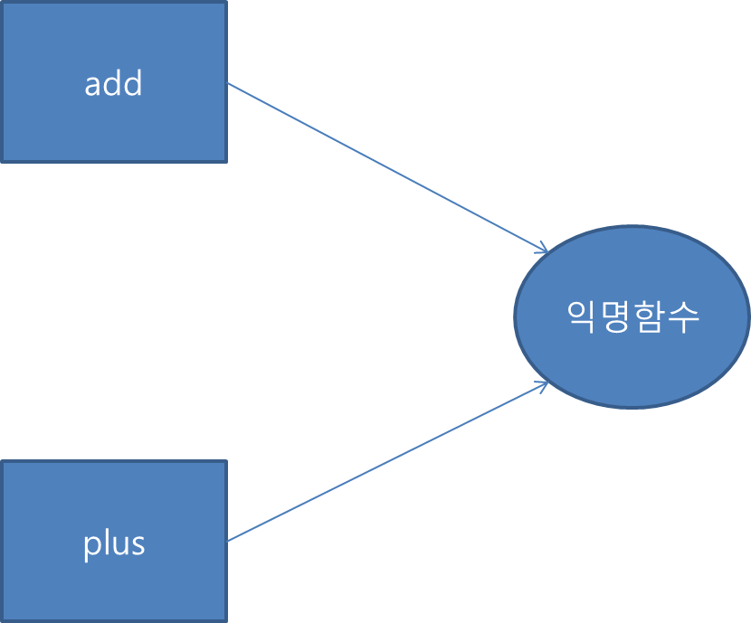
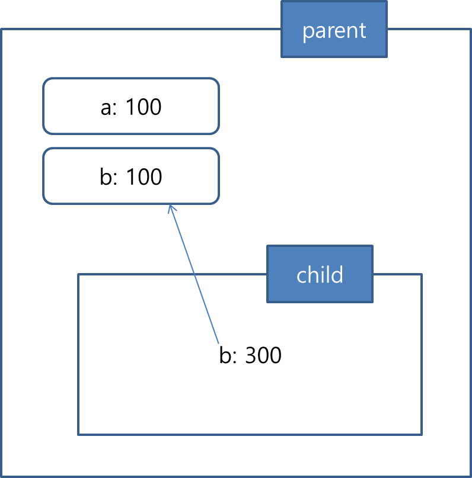

## 자바스크립트 개요
 + 자바스크립트의 활용범위
   - 서버 & 클라이언트 모두 개발가능
     - 서버개발
       - Node.js의 등장으로 서버개발도 활발히 이루어지고 있음
       - express나 socket.io등의 라이브러리가 있음
    - 모바일에서도 많이 쓰이는 추세
  + 자바스크립트의 핵심 개념
    - 객체
      - boolean, number, string, null, undefined, symbol을 제외한 나머지는 모두 객체
    - 함수
      - 자바스크립트에서는 함수도 객체로 취급
    - 프로토타입
      - 모든 객체는 숨겨진 링크인 프로토타입을 가지고있음
    - 실행컨텍스트 & 클로저
      - 자바스크립트는 실행컨텍스트를 만들고 그안에서 실행을 함
      - scope
  + 자바스크립트를 이용하면 여러 패러다임을 적용할 수 있음
    - 객체지향, 절차지향 , 반응형 등등
  + 함수형 프로그래밍
    - 높은 수준의 모듈화를 가능케 함
    - 일급객체
      -  변수나 데이터 구조안에 담을 수 있다.
      -  파라미터로 전달 할 수 있다.
      -  반환값(return value)으로 사용할 수 있다.
      -  할당에 사용된 이름과 관계없이 고유한 구별이 가능하다.
      -  동적으로 프로퍼티 할당이 가능하다.
  + 자바스크립트의 단점
    - 느슨한 타입체킹
      - 컴파일타임에서 에러를 잡지 못하기에 런타임 오류로 번짐
    - 전역객체
      - 충돌위험성이 높음

## 자바스크립트 데이터 타입과 연산자
  + premitive
    - number, string, boolean, null, undefined
  + reference
    - object
      - array
      - function
      - Rexp
  + 숫자
    - 모든 숫자를 64비트로 지정(double)
    - 정수, 소수 모두 typeof 값으로 number가 나옴
  + 문자열
    - 자바스크립트는 한번 생성된 문자열은 수정이 불가능하다.
            var str = "test";
            console.log(str);
            str[0] = 'T';
            console.log(str);
  + boolean
    - true/false
  + null & undefined
    - 일반적으로 null은 메모리가 할당 되어있지않은 껍데기 개념(명시적으로 값이 비어있음을 나타냄)
    - undefined는 메모리 공간은 존재하지만 그 안이 비어있는 개념
      - undefined는 타입
    - null은 object로 취급, 고로 null을 체크할때는 === null 로 체크를 해야됨
      - null은 타입이 아니기때문
            var nullVal = null;
            var undefinedVal = undefined;
            console.log(typeof nullVal);
            console.log(typeof undefinedVal);
  + 객체 타입
    - 단순 key: value형태의 프로퍼티들을 저장하는 컨테이너
    - 객체의 프로퍼티는 기본타입의 값을 포함하거나, 다른 객체를 가리킬 수도 있다.
    - 객체 생성방법
      - Object() 객체 생성자
              var foo = new Object();
              foo.name = 'foo';
              foo.age = 20;
              console.log(foo);
              console.log(typeof foo);

      - 객체리터럴
              var foo = {
                name : 'foo',
                age : 20
              };
      - 생성자 함수
    - 프로퍼티 접근
      - [], . 사용
  + 객체 타입의 특성
    - 같은 객체를 가리킨다는것은 한쪽을 수정하면 다른쪽도 영향을 받는다는것이다.
    - === 로 두 객체를 비교할경우 객체의 프로퍼티값이 아닌 참조값(주소값)을 비교한다.
            var obj1 = {val: 100};
            var obj2 = {val: 100};
            var obj3 = obj2;

            console.log(obj1 === obj2);
            console.log(obj2 === obj3);

    - 객체 안에는 참조값이 저장되어있으므로 === 로 비교시 참조값을 비교하는것이다.
## 배열
  + 배열의 타입은 Object다.
  + 배열의 리터럴
    - 대괄호([])를 사용한다.
            var arr = [];

  + 배열의 length 프로퍼티
    - length는 배열내의 가장 큰 인덱스의 +1 값을 가진다.
    - 가장 큰 인덱스값이 변하면 length의 값도 변한다.
    - [1,2,3]의 length을 임의로 5로 변경하면 [1,2,3,undefined,undefined]가 되며
      undefined에는 실제로 메모리가 할당되지는 않는다.
    - 반대로 length값을 줄이면 해당 데이터는 소멸된다.
  + 배열요소 삭제
    - delete를 이용할 경우 해당 인덱스의 값이 undefined로 변할뿐 length의 값은 변하지 않는다.
    - splice() 메서드를 이용하면 지정한 배열의 요소가 완전히 삭제된다
            var arr = [1,2,3,4];
            console.log(arr); // [1,2,3,4]
            arr.splice(1,1); // 1번째 인덱스부터 1개 삭제
            console.log(arr); // [1,3,4]

  + 유사배열객체
    + length프로퍼티를 가진 객체를 유사배열객체라고 함
    + 객체임에도 불구하고 자바스크립트 표준메서드를 사용하는게 가능하다는 특징이 있음
  + 연산자
    + !!연산
      - 피연산자를 불린값으로 변경

## 함수
  + 자바스크립트에서는 함수도 하나의 값으로 취급된다(일급객체)
    - 리터럴에 의해 생성
    - 변수나 배열의 요소, 객체의 프로퍼티 등에 할당 가능
    - 함수의 인자로 전달 가능
    - 함수의 리턴값으로 리턴가능
    - 동적으로 프로퍼티를 생성 및 할당 가능
  + 함수 정의 방법
    - 함수 선언문
    - 함수 표현식
    - Function() 생성자 함수
  + 함수 리터럴
           function 함수명 (매개변수) {
             함수바디
           }
  + 함수 선언문
    - 반드시 함수명이 들어가있어야한다.
  + 함수 표현식
    - 함수리터럴로 하나의 함수를 만들고, 생성된 함수를 변수에 할당하여 함수를 생성하는 방법
            var add = function(x,y){
              ....
            }
            var plus = add;
            plus(1,2); // success
    

  + 호이스팅
    - 호이스팅 : 함수의 위치에 상관없이 함수선언문 형태로 정의한 함수의 유효범위는 코드의 맨 처음부터 끝까지인데 이러한 특징을 호이스팅이라고 한다.
    - 호이스팅으로 인해 코드의 구조가 엉성해질수도 있으므로 함수 표현식 방법을 권고하고있다.
    - 원인
      - 변수생성과 초기화의 작업이 분리되서 진행되기 때문이다.
  + 자바스크립트에서는 함수 = 객채로 본다.
  + 함수객체의 기본 프로퍼티
    - arguments
    - name
      - 함수의 이름
    - caller
      - 자신을 호출한 함수
    - lenth
      - length는 모든 객체가 가져야할 프로퍼티이다.
  + 함수의 다양한 형태
    - 콜백함수
      - 이벤트나 특정 시점에 도달했을 경우 시스템에서 호출되는 함수
        - ex) 이벤트 핸들러 처리
    - 즉시실행 함수
      - 함수를 정의함과 동시에 실행하는 함수
                (function (name) { // 함수이름의 유무는 관계없다.
                  console.log(name);
                })('jack')
    - 내부함수
      - 함수내부에서 정의되는 함수
      - 클로저를 생성하거나 독립적인 헬퍼함수를 구현할때 사용하는 방식
      - 내부함수는 자신을 둘러싼 외부함수의 변수에 접근이 가능
        - 자세한 내용은 스코프체이닝 개념을 확인할 것
      
        - 위의 박스부분이 함수 스코프를 의미한다.
          - 함수스코프는 기본적으로 함수외부에서 함수스코프 내의 변수나 함수에 접근이 불가능하다.
      -
              var parent = function(){                
                var child = function(){
                  console.log('child')
                }

                return child;
              }

              var inner = parent();
              inner(); // child호출
      - 위와 같이 실행이 끝난 함수의 스코프 변수를 참조하는 inner()와 같은 함수를 클로저라고 한다.
  + 함수 호출과 this
    - arguments객체
      - arguments 객체는 함수를 호출할때 넘긴 인자들이 배열 형태로 저장된 객체다.
        - 이 객체는 유사배열객체다
    - 호출패턴과 this바인딩
      - 함수를 호출할때 기본적으로 arguments객체와 this인자가 함수 내부로 암묵적으로 전달됨
      - this
        - 함수가 호출되는 방식(호출패턴)
        - this가 다른 객체를 참조(this바인딩)하는 개념
      - 객체의 메세드를 호출할때 this 바인딩
        - 객체의 프로퍼티가 함수인경우 함수를 메서드라고 한다.
                var myObj = {
                  name: 'foo',
                  sayName: function() {
                    console.log(this.name);
                  }
                };

                var otherObj = {
                  name: 'bar'
                };

                otherObj.sayName = myObj.sayName;
                myObj.sayName(); // foo
                otherObj.sayName(); // bar

      - 함수를 호출할때 this 바인딩
        - 자바스크립트에서는 함수를 호출하면, 해당 함수 내부코드에서 사용된 this는 전역 객체에 바인딩된다.
        - call, apply함수를 이용하는 경우 this바인드를 명시적으로 처리할 수 있다.
      - 생성자 함수를 호출할때 this바인딩
        - 생성자 함수가 동작하는 방식
          1. 빈 객체 생성 및 this 바인딩
            - 생성자 함수 코드가 실행되기 전 빈 객체가 생성된다. 이 객체는 this로 바인딩 된다.
            - 생성자 함수가 생성한 객체는 prototype프로퍼티가 가리키는 객체를 자신의 프로토타입 객체로 설정한다.
          2. this를 통한 프로퍼티 생성
          3. 생성된 객체 리턴
